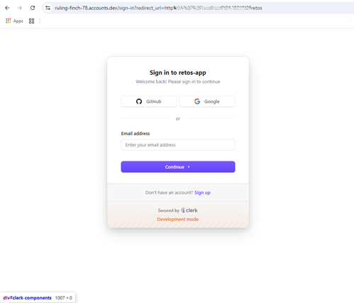
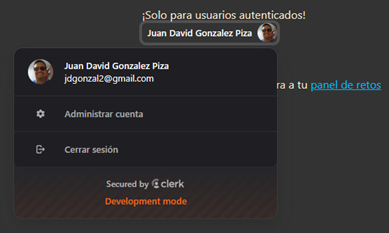
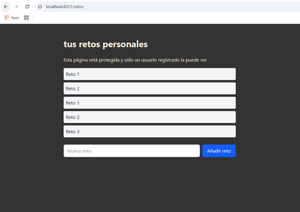
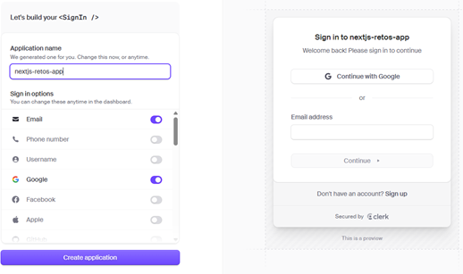

# Agrega Autenticación en tu app de Astro y Next.js con Clerk

## Auth-Astro-NextJs-Clerk

[](https://www.youtube.com/watch?v=dsw3JePcA_0&t=810s)

## 1. Intro (0:00:00)

1. Instalar `NODEJS` y `npm` en su sistema, usando el `nvm`:
  [Instalar múltiples versiones de Node.js en Windows](https://rafaelneto.dev/blog/instalar-multiples-versiones-nodejs-windows/).

```bash
nvm install [version]
nvm use [version]
```

2. Verificar las versiones de `NODEJS` instaladas en una `TERMINAL`:

```bash
nvm list
```

3. Instalar también el `pnpm` [pnpm installation](https://pnpm.io/installation), es mas rápido que el  `npm`.

4. Instalar [Visual Studio Code](https://code.visualstudio.com/insiders/).

5. Dentro de `Visual Studio Code`, se recomiendan estas extensiones:
* `Astro` de [`astro.build`](https://astro.build/) 2.15.x.
* `Better Comments` de `Aaron Bond` 3.0.x.

## 2. Creando un proyecto con Astro. (0:13:30)

1. Usando la `TERMINAL` creamos una aplicación de `astro`, con este
comando:

```bash
pnpm create astro@latest
```
* En el nombre solicitado escribimos `astro-auth`.
* Seleccionamos el mas básico: `A basic, helpful starter project`.
* Con la pregunta `Install dependencies?`, le damos `Yes`.
* Con la pregunta `Initialize a new git repository?`, le damos `No`.

2. Cambiamos a la nueva carpeta:
```bash
cd ./astro-auth
```

## 3. Agregando Tailwind. (0:15:14)

>[!TIP]
>### Recuerda siempre estar dentro de la carpeta **"astro-auth"**

1. Ejecutamos este comando en la `TERMINAL`:
```bash
pnpm astro add tailwind
```
* Con respecto a:  
`pnpm add @tailwindcss/vite@^4.1.6 tailwindcss@^4.1.6`, darle `Y`.
* Para crear un strilo global:  
`Astro will scaffold ./src/styles/global.css.`, darle `Y`.
* Nos pregunta por cambiar la configuración de astro:  
`astro.config.mjs` darle `Y`.
* Me vuelve a preguntar:  
`pnpm add @tailwindcss/vite@^4.1.6 tailwindcss@^4.1.6`, darle `Y`.

2. Abrir el archivo **`astro-auth/package.json`** y borra todos 
los _carets_ (`^`).

3. Así luce el **`astro-auth/package.json`**:
```json
{
  "name": "astro-auth",
  "type": "module",
  "version": "0.0.1",
  "scripts": {
    "dev": "astro dev",
    "build": "astro build",
    "preview": "astro preview",
    "astro": "astro"
  },
  "dependencies": {
    "@tailwindcss/vite": "4.1.6",
    "astro": "5.7.13",
    "tailwindcss": "4.1.6"
  }
}
```

4. Así se ve el **`astro-auth/astro.config.mjs`**:
```js
// @ts-check
import { defineConfig } from 'astro/config';

import tailwindcss from '@tailwindcss/vite';

// https://astro.build/config
export default defineConfig({
  vite: {
    plugins: [tailwindcss()]
  }
});
```

5. Abrimos el archivo **`astro-auth/src/pages/index.astro`**, 
editamos para dejar esto:
```js
---
import Layout from '../layouts/Layout.astro';
---

<Layout>
	<h1>Retos app</h1>
</Layout>
```

6. En la `TERMINAL` dejamos corriendo este comando:
```bash
pnpm dev
```

7. Editamos este archivo **`astro-auth/src/layouts/Layout.astro`**,
justo debajo del cierre de `</html>`, agregamos la etiqueta `<style`:
```html
<style is:global>
	@import "tailwindcss";
</style>
```

8. A la etiqueta `<style` de abaj, le agregamos en el `body`, lo
siquiente:
```html
<style>
	html,
	body {
		background: #333;
		color-scheme: light dark;
		color: antiquewhite;
		...
	}
</style>
```

## 4. Creando la interfaz de usuario. (0:17:40)

1. Regresamos al arhivo **`astro-auth/src/pages/index.astro`** y
  cambiamos la etiqueta `<h1`, por lo siguiente por `<main`
```js
<Layout>
	<main class="max-w-xl mx-auto py-12">
		<h1>App de retos personales</h1>
		<p>
			Esta es una aplicación de retos personales que te permite crear y gestionar tus propios retos. Puedes añadir nuevos retos, marcarlos como completados y eliminarlos cuando ya no los necesites.
		</p>
		<p>¡Solo para usuarios autenticados!</p>
  	</main>
</Layout>
```

2. Debajo de la última etiquieta `</p>` ponemos un `<div`
para un `<button`:
```js
		<div>
			<button class="bg-blue-500 text-white px-4 py-2 rounded">
				Iniciar Sesión
			</button>
		</div>
```
* Así luce la pantalla hasta este momento:  


3. Agregamos estilos con `class` y otra etiqueta `<p`:
```js
<Layout>
	<main class="max-w-xl mx-auto py-12">
		<h1 class="text-3xl font-bold mb-6">
			App de retos personales
		</h1>
		<p>
			Esta es una aplicación de retos personales que te permite crear y gestionar tus propios retos. Puedes añadir nuevos retos, marcarlos como completados y eliminarlos cuando ya no los necesites.
		</p>
		<p class="mt-6">¡Solo para usuarios autenticados!</p>

		<div class="mt-12">
			<button class="bg-blue-500 text-white px-4 py-2 rounded">
				Iniciar Sesión
			</button>
		</div>
		<p class="mt-12">
			Si ya has iniciado sesión, puedes ver tus retos personales en
			<a class="underline text-sky-400" href="/retos">la sección de retos</a> .
		</p>
	</main>
</Layout>
```

4. Creamos el archivo **`astro-auth/src/pages/retos.astro`**,
con este código:
```js
---
import Layout from '../layouts/Layout.astro';
---

<Layout title = "🔒 Private">
	<main class="max-w-xl mx-auto py-12">
		<h1 class="text-3xl font-bold mb-6">
			tus retos personales
		</h1>
		<p>Esta página está protegida y sólo un usuario registrado la puede ver</p>
    <ul>
      <li></li>
    </ul> 
	</main>
</Layout>
```

5. Agregar al archivo **`astro-auth/src/pages/index.astro`**,
en el renderizado del `<Layout` un `title`:
```js
<Layout title = "🔓 Public - Start App">
```

6. Corregimos el archivo **`astro-auth/src/layouts/Layout.astro`**
agregando una `const` en el tope entre triple guión `---`:
```js
---
	const {title} = Astro.props;
---
```
7. Cambiamos la propiedad `<title>` por el valor de la constante:
```js
		<title>{title}</title>
```

## 5. Nuestra primer autenticación. (0:21:27)

1. Vamos a la Página de [clerk.com](https://clerk.com/), y le damos
al botón de `[Sign in]`.


2. Usamos una cuenta de `GitHub` y autorizamos a `clerk`.


3. En esta pantalla:  
  
* Escribimos el nombre `retos-app`.


4. Activamos el botón de `GitHub` y así se ve la pantalla:  


5. Damos clic en el botón `[Create application]`.


## 6. Instalando Clerk en Astro. (0:25:41)

1. Damos clic en el botón de `Astro`,  en la página
 `https://dashboard.clerk.com/` para ver como realizar
la configuración.

2. Ingresamos en la `TERMINAL` a la carpeta de **"astro-auth"**:
```bash
cd ./astro-auth 
```

3. Ejecutamos el primer comando `Install @clerk/astro`, en una
`TERMINAL`, este comando:
```bash
pnpm add @clerk/astro -E
```

4. El paso dos es copiar las variables de ambiente en un
archivo nuevo de nombre **`astro-auth/.env`**,
con dos valores:
```ini
PUBLIC_CLERK_PUBLISHABLE_KEY=pk_test_*******
CLERK_SECRET_KEY=sk_test_*******
```
>[!TIP]  
>### El archivo **`.env`**, jamás se sube al repositorio.

5.  Ejecutamos otro comando en la `TERMINAL`, porque se debe tener
un adaptador de _Server Side Rendering_:
```bash
pnpm add @astrojs/node -E
```

6. Abrimos el archivo **`astro-auth/astro.config.mjs`**, y copiamos
el paso tres del sitio de `clerk.com`:
```js
// @ts-check
import { defineConfig } from 'astro/config';
import node from "@astrojs/node";
import clerk from "@clerk/astro";

import tailwindcss from '@tailwindcss/vite';

// https://astro.build/config
export default defineConfig({
  integrations: [clerk()],
  vite: {
    plugins: [tailwindcss()]
  },
  adapter: node({ mode: "standalone" }),
  output: "server",
});
```

## 7. Creando nuestro middleware. (0:32:48)

1. Creamos el archivo **`astro-auth/src/middleware.ts`**.
2. El sitio `https://dashboard.clerk.com/`, copiamos el contenido
del paso cuatro, en el nuevo archivo.
3. Mejoramos el contenido del llamado a la función `clerkMiddleware()` con un _Callback_:
```js
import { defineMiddleware } from "astro:middleware";

export const onRequest = defineMiddleware((context, next) => {
  console.log("Middleware triggered");
  const lang = context.request.headers.get("accept-language");
  console.log("Language:", lang);
  return next();
});
```
4. Comentamos nuestro código y ponemos el del paso 2:
```js
import { clerkMiddleware } from "@clerk/astro/server";

export const onRequest = clerkMiddleware();
```

## 8. Proteger rutas. (0:44:12)

1. Añadimos a la importación de **`astro-auth\src\middleware.ts`**
un `createRouteMatcher` y la definimos en una constante de 
nombre `matcher`:
```js
import { clerkMiddleware, createRouteMatcher } from '@clerk/astro/server';

const isProtectedRoute = createRouteMatcher(['/retos(.*)']);
```

2. le pasamos un _Callback_ a la función `clerkMiddleware()`:
```js
export const onRequest = clerkMiddleware((auth, context) => {
  const { userId } = auth(); // Recuperamos el userId

  // Validamos las rutas protegidas
  if (isProtectedRoute(context.request) && !userId) {
    // Redireccionamos la respuesta a la raíz
    return Response.redirect(new URL('/', context.request.url));
  }
});
```

3. Mejoramos la redirección no a la raíz sino a un sitio que
proporciona `clerk` , que es un inicio se sesión:
```js
export const onRequest = clerkMiddleware((auth, context) => {
  const { userId, redirectToSignIn } = auth(); // Recuperamos el userId

  // Validamos las rutas protegidas
  if (isProtectedRoute(context.request) && !userId) {
    // Redireccionamos la respuesta a la raíz
    // return Response.redirect(new URL('/', context.request.url));
    return redirectToSignIn(); // Redireccionamos a inicio se sesión
  }
});
```

4. Al hacer clic en el link que nos llevará a la página 
`/retos`, nos abre una sitio para hacer el `Sign In`:  



## 9. Componentes de Clerk. (0:49:08)

1. Vamos al archivo **`astro-auth/src/pages/index.astro`** e
importamos algunos componente de `clerk`:
```js
import {
	SignedIn,
	SignedOut,
	SignInButton,
	UserButton,
} from '@clerk/astro/components';
```

2. Ajustamos el botón de `Iniciar Sesión`, dentro del 
renderizado o llamado del componente `<SignedOut`:
```js
		<SignedOut>
			<div class="mt-12">
				<button class="bg-blue-500 text-white px-4 py-2 rounded">
					Iniciar Sesión
				</button>
			</div>	
		</SignedOut>
```

3. Si el usuario está autenticado o iniciado sesión
usamos el renderizado del componente `<SignedIn`:
```js
		<SignedIn>
			<p class="mt-12">
				¡Ya has iniciado sesión!, Entra a tu 
				<a class="underline text-sky-400" href="/retos">
				panel de retos</a>
			</p>
		</SignedIn>
```

4. Cambiamos la etiqueta `<button` por el componente `<SignInButton`:
```js
		<SignedOut>
			<div class="mt-12">
				<SignInButton class="bg-blue-500 text-white px-4 py-2 rounded">
					Iniciar Sesión
				</SignInButton>
			</div>	
		</SignedOut>
```

6. Simplemente Dentro del renderizado de `<SignedIn`, llamamamos
el componente `<UserButton/>`.

7. Así se ve el funcionamiento hasta el momento:  


## 10. Agregando estilos a los componentes de Clerk. (0:52:31)

1. Al renderizado del componente `<SignInButton`, activamos una
propiedad de nombre `mode` y el valor `"modal"`:
```js
				<SignInButton mode="modal" class="bg-blue-500 text-white px-4 py-2 rounded">
					Iniciar Sesión
				</SignInButton>
```
* Nos aparece en forma de modal:  


2. Otro Ejemplo en el renderizado de `<SignInButton`, le ponemos
la propiedad `appearance` y ponemos a cada elemento su estilo:
```js
				<SignInButton 
				mode="modal" 
				class="bg-blue-500 text-white px-4 py-2 rounded"
				appearance={
					{
						elements: {
							// Customize the sign-in button
							buttonPrimary: 'bg-blue-500 text-white',
							footerItem: 'text-gray-500',
						},
					}
				}>
					Iniciar Sesión
				</SignInButton>
```

3. Podemos tener una tanda basada en temas de este sitio
[Themes](https://clerk.com/docs/customization/themes), pero se
debe instalar en una `TERMINAL` con este comando:
```bash
pnpm add @clerk/themes -E
```
4. Importamos en **`astro-auth/astro.config.mjs`** uno de los
tantos temas y lo usamos:
```js
// @ts-check
import { defineConfig } from 'astro/config';
import node from '@astrojs/node';
import clerk from '@clerk/astro';
import { neobrutalism } from '@clerk/themes';

import tailwindcss from '@tailwindcss/vite';

// https://astro.build/config
export default defineConfig({
  integrations: [
    clerk({
      appearance: {
        baseTheme: neobrutalism,
      },
    }),
  ],
  vite: {
    plugins: [tailwindcss()],
  },
  adapter: node({ mode: 'standalone' }),
  output: 'server',
});
```

5. Al presionar el botón `[Iniciar Sesión]`, nos aparece algo así:  


6. También le podemos agregar al renderizado de `<UserButton/>`, 
que muestre el nombre del usuario:
```js
			<UserButton showName/>
```

7. Cambiamos el Tema de `neobrutalism` a `dark` y así se ve la
página de cuando se tiene el usuario validado:  


## 11. Cambiar el idioma de Clerk. (0:55:35)

1. Del sitio [Localization](https://clerk.com/docs/customization/localization)
usamos el comando para instalar en la `TERMINAL`:
```bash
pnpm add @clerk/localizations -E
```

2. Vamos al archivo **`astro-auth/astro.config.mjs`**, e 
importamos el idioma que vamos a utilizar y se pone en
`defineConfig`:
```js
...
import { esMX } from '@clerk/localizations';
...
// https://astro.build/config
export default defineConfig({
  integrations: [
    clerk({
      localization: esMX,
      appearance: {
        baseTheme: dark,
      },
    }),
  ],
  ...
});
```

3. Vamos al ícono o botón del usuario y eso nos aparece:  



## 12. Componentes para los retos. (0:57:03)

1. En la carpeta **"astro-auth/src/components"** 
creamos dos archivos :
* [**`ChallengesList.astro`**](https://github.com/midudev/hackaton-clerk-2025/blob/ec6513c8e68723939c8f6a89d570957e3267d6e5/astro-auth/src/components/ChallengesList.astro)
* [**`AddChallenge.astro`**](https://github.com/midudev/hackaton-clerk-2025/blob/ec6513c8e68723939c8f6a89d570957e3267d6e5/astro-auth/src/components/AddChallenge.astro#L7) 
 
2. El contenido de los archivos está en el repositorio
[hackaton-clerk-2025](https://github.com/midudev/hackaton-clerk-2025/)


## 13. Creando API. (1:00:16)

1. Creamos la carpeta **"lib"** dentro de
**"astro-auth/src"**.

2. Dentro de la nueva carpeta creamos el archivo **`db.ts`**, 
con el contenido de [**`db.ts`**](https://github.com/midudev/hackaton-clerk-2025/blob/main/astro-auth/src/lib/db.ts).

3. En la carpeta **"astro-auth/src/pages"**, creamos la carpeta
**"api"**.

4. En la nueva carpeta creamos el archivo **`challenges.json.ts`**,
con el contenido de este sitio [**`challenges.json.ts`**](https://github.com/midudev/hackaton-clerk-2025/blob/main/astro-auth/src/pages/api/challenges.json.ts)

5. Se ajustan algunos datos en el archivo **`challenges.json.ts`**:
```js
...
export const GET: APIRoute = async ({ locals }) => {
  // const user = await locals.currentUser();
  // if (!user) return new Response('Unauthorized', { status: 401 });
  const user = { id: 'testUser' }; // Mock user for testing
  ...

export const POST: APIRoute = async ({ locals, request }) => {
  // const user = await locals.currentUser();
  const user = { id: 'testUser' }; // Mock user for testing
  ...
};
```

6. Añadimos el uso de los componentes en la página
**`astro-auth/src/pages/retos.astro`**, cambiando la etiqueta
`<ul`:
```js
---
import AddChallenge from '../components/AddChallenge.astro';
import ChallengesList from '../components/ChallengesList.astro';
import Layout from '../layouts/Layout.astro';
---

<Layout title = "🔒 Private">
	<main class="max-w-xl mx-auto py-12">
		<h1 class="text-3xl font-bold mb-6">
			tus retos personales
		</h1>
		<p>Esta página está protegida y sólo un usuario registrado la puede ver</p>
    <ChallengesList retos={[]} />
		<AddChallenge />	
	</main>
</Layout>
```

7. Al ingresar a la página de `retos` con un usuario autenticado,
nos aparece esta pantalla:  


8. Los estilos de la etiqueta `<ul` en el archivo 
**`astro-auth/src/components/ChallengesList.astro`**, ya
tienen el `flex flex-col`.

9. En el archivo **`astro-auth/src/pages/retos.astro`**, añadimos
que muestre al principio los retos guardados o recuperados con base en
el `getUserChallenges()` de **`astro-auth/src/lib/db.ts`**:
```js
---
...
import { getUserChallenges } from '../lib/db';

const userId = 'testUser'; // Mock user from `challenges.json.ts`
const challenges = await getUserChallenges(userId);
---

<Layout title = "🔒 Private">
	<main class="max-w-xl mx-auto py-12">
		...
    <ChallengesList retos={challenges} />
		...	
	</main>
</Layout>
```

10. así se ve la página de `retos` con lo recuperado del archivo
que se almacena en **`/tmp/data/challenges/testUser.json`**:  



## 14. Recuperar la ID del usuario. (1:10:58)

1. Cambiamos en el archivo **`retos.astro`**, en la la línea de
`const userId = 'testUser';`, por un valor que ya tiene `Astro`:
```js
---
...
const user = await Astro.locals.currentUser();
if(!user) {
	// return Astro.redirect('/login');
	return new Response('Unauthorized', { status: 401 });
}
const userId = user.id;
const challenges = await getUserChallenges(userId);
---
```

2. Vamos a la _API_ de nombre **`challenges.json.ts`**, y recuperamos
el ID del usuario de manera similar:
```js
...
export const GET: APIRoute = async ({ locals }) => {
  const user = await locals.currentUser();
  if (!user) return new Response('Unauthorized', { status: 401 });
  ...
};

export const POST: APIRoute = async ({ locals, request }) => {
  const user = await locals.currentUser();
  if (!user) return new Response('Unauthorized', { status: 401 });
  ...
};
```


## 15. Creando proyecto con Next.js. (1:21:39)

1. Detenemos la ejecución del proyecto de `ASTRO`

2. En una `TERMINAL` ubicados en la raíz del proyecto ejecutamos
el siguiente comando:
```bash
pnpm dlx create-next-app@latest nextjs-auth
```
* Responder a las solictudes de la siguiente manera:
```dos
Packages: +1
+
Progress: resolved 1, reused 0, downloaded 1, added 1, done
? Would you like to use TypeScript? » No / Yes <- Yes
? Would you like to use ESLint? » No / Yes -> Yes
? Would you like to use Tailwind CSS? » No / Yes <- Yes
? Would you like your code inside a `src/` directory? » No / Yes <- Yes
? Would you like to use App Router? (recommended) » No / Yes <- Yes
? Would you like to use Turbopack for `next dev`? ... No / Yes <- Yes
? Would you like to customize the import alias (`@/*` by default)? » No / Yes <- No
```
* Hace el proceso de instalación y listo:
```dos
Creating a new Next.js app in E:\tutorials\nodejs\Auth-Astro-NextJs-Clerk\nextjs-auth.

Using pnpm.

Initializing project with template: app-tw


Installing dependencies:
- react
- react-dom
- next

Installing devDependencies:
- typescript
- @types/node
- @types/react
- @types/react-dom
- @tailwindcss/postcss
- tailwindcss
- eslint
- eslint-config-next
- @eslint/eslintrc
...
dependencies:
+ next 15.3.2
+ react 19.1.0
+ react-dom 19.1.0

devDependencies:
+ @eslint/eslintrc 3.3.1
+ @tailwindcss/postcss 4.1.7
+ @types/node 20.17.50 (22.15.21 is available)
+ @types/react 19.1.4
+ @types/react-dom 19.1.5
+ eslint 9.27.0
+ eslint-config-next 15.3.2
+ tailwindcss 4.1.7
+ typescript 5.8.3
```

>[!TIP]  
>### Abrir el archivo **`nextjs-auth/package.json`** y borra todos los _carets_ (`^`).

3. Cambiamos al directorio que se acaba de crear y ejecutamos el comando para que el proyecto corra, casi siempre en el puerto 3000:
```bash
cd nextjs-auth
pnpm dev
```
* Así ejecuta el proyecto:
```dos
> next dev --turbopack

   ▲ Next.js 15.3.2 (Turbopack)
   - Local:        http://localhost:3000
   - Network:      http://192.168.1.11:3000

 ✓ Starting...
 ✓ Ready in 2.5s
```


## 16. Instalando Clerk. (1:22:20)

1. Entro al sitio de `clerk.com/` y voy al botón del extremo derecho
de `[Dashboard]`.

2. Y en el botón de `[retos-app]`, selecciono `Create application`

3. En el cuadro de `Application name`, el ponemos: `nextjs-retos-app`:  

* Damos clic en `[Create application]`.


4. Siguiendo las instrucciones de la página que abre, el punto `1`, 
ejecutar en una `TERMINAL` estos comandos:
```bash
cd .\nextjs-auth\
pnpm add @clerk/nextjs -E
```

5. Creamos en la carpeta **"src"**, el archivo **`middleware.ts`**,
con el contenido del punto `3`:
```js
import { clerkMiddleware } from '@clerk/nextjs/server';

export default clerkMiddleware();

export const config = {
  matcher: [
    // Skip Next.js internals and all static files, unless found in search params
    '/((?!_next|[^?]*\\.(?:html?|css|js(?!on)|jpe?g|webp|png|gif|svg|ttf|woff2?|ico|csv|docx?|xlsx?|zip|webmanifest)).*)',
    // Always run for API routes
    '/(api|trpc)(.*)',
  ],
};
```

## 17. Configurando Clerk (Sign in/ui). (1:24:24)

1. En el archivo **`nextjs-auth/src/app/layout.tsx`**, pongo la
importación de todos los componentes del paso `4`:
```js
import {
  ClerkProvider,
  SignInButton,
  SignUpButton,
  SignedIn,
  SignedOut,
  UserButton,
} from '@clerk/nextjs'
```

2. En el `return` del **`layout.tsx`**, envolvemos todo con el
renderizado de `<ClerkProvider`:
```js
  return (
    <ClerkProvider>
      <html lang='en'>
        <body
          className={`${geistSans.variable} ${geistMono.variable} antialiased`}
        >
          {children}
        </body>
      </html>
    </ClerkProvider>
  );
```

3. Justo debajo de la apertura del la etiqueta `<body`, añadimos
una etiqueta `<header` con lo que viene de la página del punto `4`:
```js
					<header className="flex justify-end items-center p-4 gap-4 h-16">
            <SignedOut>
              <SignInButton />
              <SignUpButton />
            </SignedOut>
            <SignedIn>
              <UserButton />
            </SignedIn>
          </header>
```

4. Así me aparece la imagen con los nuevos botones:  
![[Sign In] y [Sign Up]](images/2025-05-21_181302.png "[Sign In] y [Sign Up]")


5. Vamos al archivo **`nextjs-auth/src/app/page.tsx`** para hacer
algunos cambios:
```js
import Image from 'next/image';
import Link from 'next/link';

export default function Home() {
  return (
    <div className='grid grid-rows-[20px_1fr_20px] items-center justify-items-center min-h-screen p-8 pb-20 gap-16 sm:p-20 font-[family-name:var(--font-geist-sans)]'>
      <main className='flex flex-col gap-[32px] row-start-2 items-center sm:items-start'>
        <h1 className='text-4xl sm:text-6xl font-bold text-center'>
          Next.js + Clerk
        </h1>
        <div className='flex gap-4 items-center flex-col sm:flex-row'>
          <Link
            className='rounded-full border border-solid border-transparent transition-colors flex items-center justify-center bg-foreground text-background gap-2 hover:bg-[#383838] dark:hover:bg-[#ccc] font-medium text-sm sm:text-base h-10 sm:h-12 px-4 sm:px-5 sm:w-auto'
            href='/protected'

          >
            <Image
              className='dark:invert'
              src='/vercel.svg'
              alt='Vercel logomark'
              width={20}
              height={20}
            />
            Entrar a página protegida
          </Link>
        </div>
      </main>
    </div>
  );
}
```


## 18. Página protegida. (1:27:16)

1. Creamos el archivo **`nextjs-auth/src/app/protected/page.tsx`**
y le escribimos el _snippet_ de `rfce`:
```js
import React from 'react';

function Protected() {
  return <div>protected</div>;
}

export default Protected;
```

2. Mejoramos el `return` del archivo **`.../protected/page.tsx`**:
```js
  return (
    <div
      className='grid grid-rows-[20px_1fr_20px] items-center
    justify-items-center min-h-screen p-8 pb-20 gap-16 sm:p-20
    font-[family-name:var(--font-geist-sans)]'
    >
      <main className='flex flex-col gap-[32px] row-start-2 items-center'>
        <h1>Protected</h1>
      </main>
    </div>
  );
```

3. En el archivo **`nextjs-auth/src/app/layout.tsx`**, al renderizado
de `<SignInButton` y `<SignUpButton` , agregamos la propiedad
`mode`:
```js
            <SignedOut>
              <SignInButton mode='modal' />
              <SignUpButton mode='modal' />
            </SignedOut>
```

4. Creamos el archivo **`.env`** en la carpeta **"nextjs-auth"**,
y pegamos el contenido del paso `2`, del sitio donde tenemos nuestro
último proyecto de `clerk.com`.
