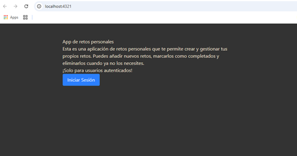
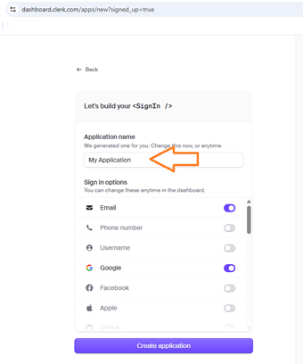
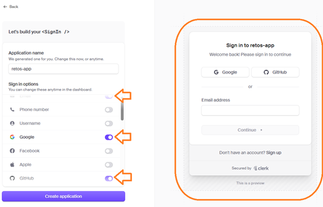

# Agrega Autenticación en tu app de Astro y Next.js con Clerk

## Auth-Astro-NextJs-Clerk

[](https://www.youtube.com/watch?v=dsw3JePcA_0&t=810s)

## 1. Intro (0:00:00)

1. Instalar `NODEJS` y `npm` en su sistema, usando el `nvm`:
  [Instalar múltiples versiones de Node.js en Windows](https://rafaelneto.dev/blog/instalar-multiples-versiones-nodejs-windows/).

```bash
nvm install [version]
nvm use [version]
```

2. Verificar las versiones de `NODEJS` instaladas en una `TERMINAL`:

```bash
nvm list
```

3. Instalar también el `pnpm` [pnpm installation](https://pnpm.io/installation), es mas rápido que el  `npm`.

4. Instalar [Visual Studio Code](https://code.visualstudio.com/insiders/).

5. Dentro de `Visual Studio Code`, se recomiendan estas extensiones:
* `Astro` de [`astro.build`](https://astro.build/) 2.15.x.
* `Better Comments` de `Aaron Bond` 3.0.x.

## 2. Creando un proyecto con Astro. (0:13:30)

1. Usando la `TERMINAL` creamos una aplicación de `astro`, con este
comando:

```bash
pnpm create astro@latest
```
* En el nombre solicitado escribimos `astro-auth`.
* Seleccionamos el mas básico: `A basic, helpful starter project`.
* Con la pregunta `Install dependencies?`, le damos `Yes`.
* Con la pregunta `Initialize a new git repository?`, le damos `No`.

2. Cambiamos a la nueva carpeta:
```bash
cd ./astro-auth
```

## 3. Agregando Tailwind. (0:15:14)

>[!TIP]
>### Recuerda siempre estar dentro de la carpeta **"astro-auth"**

1. Ejecutamos este comando en la `TERMINAL`:
```bash
pnpm astro add tailwind
```
* Con respecto a:  
`pnpm add @tailwindcss/vite@^4.1.6 tailwindcss@^4.1.6`, darle `Y`.
* Para crear un strilo global:  
`Astro will scaffold ./src/styles/global.css.`, darle `Y`.
* Nos pregunta por cambiar la configuración de astro:  
`astro.config.mjs` darle `Y`.
* Me vuelve a preguntar:  
`pnpm add @tailwindcss/vite@^4.1.6 tailwindcss@^4.1.6`, darle `Y`.

2. Abrir el archivo **`astro-auth/package.json`** y borra todos 
los _carets_ (`^`).

3. Así luce el **`astro-auth/package.json`**:
```json
{
  "name": "astro-auth",
  "type": "module",
  "version": "0.0.1",
  "scripts": {
    "dev": "astro dev",
    "build": "astro build",
    "preview": "astro preview",
    "astro": "astro"
  },
  "dependencies": {
    "@tailwindcss/vite": "4.1.6",
    "astro": "5.7.13",
    "tailwindcss": "4.1.6"
  }
}
```

4. Así se ve el **`astro-auth/astro.config.mjs`**:
```js
// @ts-check
import { defineConfig } from 'astro/config';

import tailwindcss from '@tailwindcss/vite';

// https://astro.build/config
export default defineConfig({
  vite: {
    plugins: [tailwindcss()]
  }
});
```

5. Abrimos el archivo **`astro-auth/src/pages/index.astro`**, 
editamos para dejar esto:
```js
---
import Layout from '../layouts/Layout.astro';
---

<Layout>
	<h1>Retos app</h1>
</Layout>
```

6. En la `TERMINAL` dejamos corriendo este comando:
```bash
pnpm dev
```

7. Editamos este archivo **`astro-auth/src/layouts/Layout.astro`**,
justo debajo del cierre de `</html>`, agregamos la etiqueta `<style`:
```html
<style is:global>
	@import "tailwindcss";
</style>
```

8. A la etiqueta `<style` de abaj, le agregamos en el `body`, lo
siquiente:
```html
<style>
	html,
	body {
		background: #333;
		color-scheme: light dark;
		color: antiquewhite;
		...
	}
</style>
```

## 4. Creando la interfaz de usuario. (0:17:40)

1. Regresamos al arhivo **`astro-auth/src/pages/index.astro`** y
  cambiamos la etiqueta `<h1`, por lo siguiente por `<main`
```js
<Layout>
	<main class="max-w-xl mx-auto py-12">
		<h1>App de retos personales</h1>
		<p>
			Esta es una aplicación de retos personales que te permite crear y gestionar tus propios retos. Puedes añadir nuevos retos, marcarlos como completados y eliminarlos cuando ya no los necesites.
		</p>
		<p>¡Solo para usuarios autenticados!</p>
  	</main>
</Layout>
```

2. Debajo de la última etiquieta `</p>` ponemos un `<div`
para un `<button`:
```js
		<div>
			<button class="bg-blue-500 text-white px-4 py-2 rounded">
				Iniciar Sesión
			</button>
		</div>
```
* Así luce la pantalla hasta este momento:  


3. Agregamos estilos con `class` y otra etiqueta `<p`:
```js
<Layout>
	<main class="max-w-xl mx-auto py-12">
		<h1 class="text-3xl font-bold mb-6">
			App de retos personales
		</h1>
		<p>
			Esta es una aplicación de retos personales que te permite crear y gestionar tus propios retos. Puedes añadir nuevos retos, marcarlos como completados y eliminarlos cuando ya no los necesites.
		</p>
		<p class="mt-6">¡Solo para usuarios autenticados!</p>

		<div class="mt-12">
			<button class="bg-blue-500 text-white px-4 py-2 rounded">
				Iniciar Sesión
			</button>
		</div>
		<p class="mt-12">
			Si ya has iniciado sesión, puedes ver tus retos personales en
			<a class="underline text-sky-400" href="/retos">la sección de retos</a> .
		</p>
	</main>
</Layout>
```

4. Creamos el archivo **`astro-auth/src/pages/retos.astro`**,
con este código:
```js
---
import Layout from '../layouts/Layout.astro';
---

<Layout title = "🔒 Private">
	<main class="max-w-xl mx-auto py-12">
		<h1 class="text-3xl font-bold mb-6">
			tus retos personales
		</h1>
		<p>Esta página está protegida y sólo un usuario registrado la puede ver</p>
    <ul>
      <li></li>
    </ul> 
	</main>
</Layout>
```

5. Agregar al archivo **`astro-auth/src/pages/index.astro`**,
en el renderizado del `<Layout` un `title`:
```js
<Layout title = "🔓 Public - Start App">
```

6. Corregimos el archivo **`astro-auth/src/layouts/Layout.astro`**
agregando una `const` en el tope entre triple guión `---`:
```js
---
	const {title} = Astro.props;
---
```
7. Cambiamos la propiedad `<title>` por el valor de la constante:
```js
		<title>{title}</title>
```

## Nuestra primer autenticación. (0:21:27)

1. Vamos a la Página de [clerk.com](https://clerk.com/), y le damos
al botón de `[Sign in]`.


2. Usamos una cuenta de `GitHub` y autorizamos a `clerk`.


3. En esta pantalla:  
  
* Escribimos el nombre `retos-app`.


4. Activamos el botón de `GitHub` y así se ve la pantalla:  



5. Damos clic en el botón `[Create application]`.
